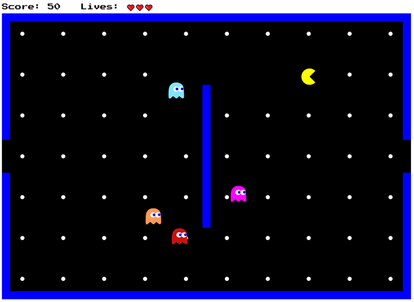

# Programmieren lernen am Beispiel von Pacman

> Wenn du nur einen neuen Skill erlernen kannst, entscheide dich für das Programmieren. Damit hast du die Fähigkeit, einer Maschine alles andere beizubringen.

## Ziele

### Was machen wir und was lernst du hier?

Dies ist ein Online-Tutorial für Einsteiger in die Programmierung am Beispiel von Pacman. In diesem Tutorial gehen wir Schritt für Schritt vor und erstellen auf dem Weg ein funktionsfähiges Online-Spiel.

Die Entwicklung eines Spiels von Beginn an ist ein gutes Projekt für das Erlernen der Programmierung. Zum einen haben wir ein klares Ziel vor Augen und wissen, wie das Ergebnis am Ende aussehen soll. Das erhöht die Motivation, die wiederum wichtig ist, um in frustrierenden Phasen am Ball zu bleiben. Und Frustration wird es viel geben, wenn man zum ersten Mal programmiert (aber auch danach, nur nimmt das langsam Schritt für Schritt ab).

Es geht bei diesem Tutorial **nicht** darum, dass du am Ende ein professioneller Programmierer bist. Das kann kein Tutorial leisten und es bedarf zudem langjährige Erfahrung. Es geht mir in diesem Tutorial darum, dass du **die Grundideen der Programmierung verstehst und die wichtigsten Konzepte anwenden kannst**. Erstaunlicherweise lässt sich das scheinbar komplexe Thema der Programmierung auf wenige Konzepte reduzieren, die man einmal richtig durchdrungen haben sollte:

- Das Konzept der **Variablen** für das Speichern von Inhalten.
- Das Konzept der **Befehle oder Operationen**, um Inhalte zu verändern.
- Das Konzept der **Kontrollstrukturen**, um Entscheidungen zu treffen. 
- Das Konzept der **Schleifen**, um dieselben Dinge mehrmals zu tun.
- Das Konzept der **Funktionen**, um die gefundene Lösung für ein Problem immer wieder anwenden zu können.

Diese fünf Konzepte sind Bestandteil eines **Programms**, das aus einer Abfolge von Anweisungen besteht, die beim Ausführen nacheinander abgearbeitet werden.

### Warum Javascript?

Für Neueinsteiger in die Programmierung spielt die verwendte Sprache so gut wie keine Rolle. Um die Logik der Programmierung kennenzulernen ist es sogar sinnvoll, mit einer Pseudo-Programmiersprache zu beginnen (z.B. mit dem [Karel Roboter](https://github.com/fredoverflow/karel)). Wenn wir aber das Ziel verfolgen, am Ende ein funktionstüchtiges Online-Spiel entwickelt zu haben, dann müssen wir zwangsweise eine Programmiersprache wählen, die unser Browser versteht. Und das ist aktuell Javascript.

# Die Lektionen

- [Lektion 1: Das Projekt aufsetzen](tutorial/lektion_01/README.md)
- [Lektion 2: Die Zeichenfläche für unser Spiel erstellen](tutorial/lektion_02/README.md)